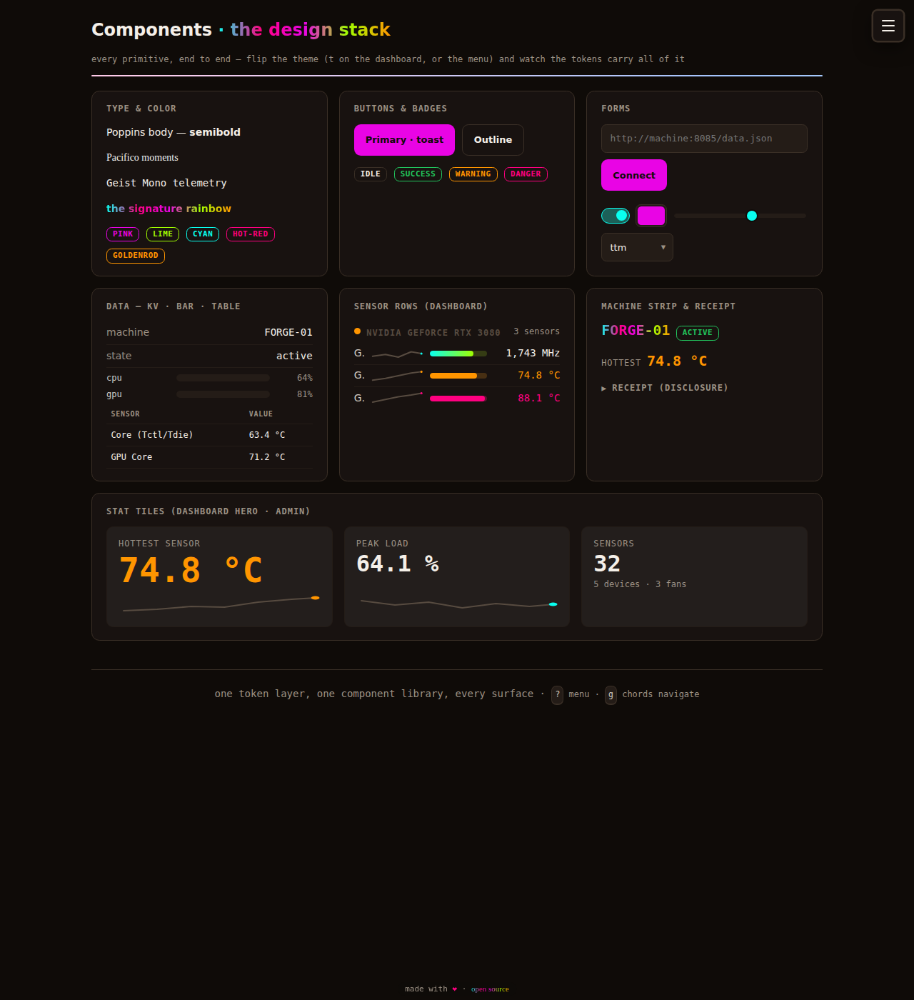
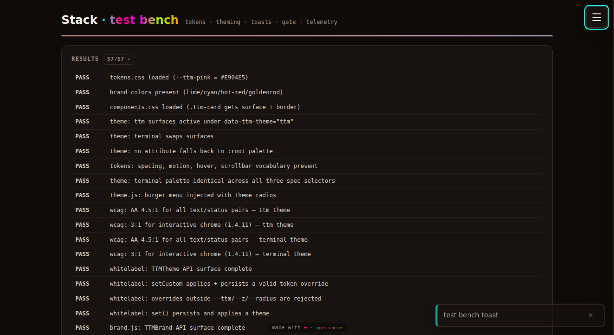

# Open Hardware Monitor — fork with a web dashboard

This fork adds a static web dashboard for Open Hardware Monitor's embedded
sensor server, together with a tokenized design system, a whitelabel layer,
and a SpaceAPI publishing bridge. All additions live under [`web/`](web/);
the C# application is unmodified.

Demo deployment: **https://ohm.thetechmargin.com** — `?demo=1` loads a
generated 32-sensor feed, so no hardware or install is required to evaluate
it.

| Dark theme (default) | Terminal theme |
|---|---|
|  |  |

## Scope of the fork

- **Dashboard** (`web/index.html`, `dashboard.js`) — polls the embedded
  server's `/data.json`, renders sensors grouped by hardware with
  configurable warn/hot thresholds, and a machine summary strip
  (activity, hottest temperature, peak load, counts).
- **Design system** (`web/ttm/`) — a single token layer (colors, type,
  spacing, motion, z-index) consumed by one component library; two themes
  verified against WCAG 2.1 AA by computed contrast checks; site-wide
  whitelabeling via published config, with per-visitor overrides taking
  precedence. The application ships unbranded; identity is configuration.
- **Publishing bridge** (`web/bridge.js`) — generates a SpaceAPI v14
  fragment from the live feed: activity as `state.open`, temperatures and
  fans as `sensors`, with optional extensions for
  [Four Corners](https://fourcornersproject.org) attribution,
  [IIIF Image API 3](https://iiif.io) imagery, and Wikidata-anchored
  [OKW](https://github.com/iop-alliance/OpenKnowWhere) manufacturing
  capabilities, for registration on
  [Maps of Making](https://maps.thetechmargin.com).
- **Test bench** (`web/test/`) — 48 in-browser assertions covering the
  sensor core, the bridge (including the extension contracts), theming,
  the whitelabel runtime, and WCAG contrast computed from live token
  values. Runs from `file://` or the deployed site; no build step.

| Component gallery (`/components/`) | Test bench (`/test/`) |
|---|---|
|  |  |

## Demo URLs

| URL | Contents |
|---|---|
| [/?demo=1](https://ohm.thetechmargin.com/?demo=1) | dashboard on generated demo data |
| [/components/](https://ohm.thetechmargin.com/components/) | component gallery |
| [/test/?nogate=1](https://ohm.thetechmargin.com/test/?nogate=1) | test bench |
| [/admin/](https://ohm.thetechmargin.com/admin/) | operator panel: telemetry, visitors, whitelabel editor (token-gated) |

Keyboard: <kbd>d</kbd> demo · <kbd>t</kbd> theme · <kbd>?</kbd> menu ·
<kbd>g</kbd> then <kbd>d</kbd>/<kbd>c</kbd>/<kbd>t</kbd>/<kbd>a</kbd>/<kbd>m</kbd>
navigates.

## Running locally

```bash
git clone https://github.com/binaryLady/openhardwaremonitor.git
cd openhardwaremonitor
python3 -m http.server 8080 --directory web
# http://localhost:8080/?demo=1, or point the source bar at a machine
# running Open Hardware Monitor's remote web server
```

Deployment: `vercel.json` + `build-web.sh` stage `web/` into `public/`
for any static host. Supabase is optional (visitor gate, telemetry,
whitelabel publishing); the schema with its RPC-only access model is
[`supabase/schema.sql`](supabase/schema.sql). Without it the site runs
local-only.

Further documentation: [`web/README.md`](web/README.md) (architecture,
data contract, security model) · [`THEMING.md`](THEMING.md) (theme and
whitelabel model).

## Lineage and licensing

The Windows application is the original
[Open Hardware Monitor](https://openhardwaremonitor.org) (MPL-2.0); this
fork's additions are strictly additive and carry the same license. The
design system and publishing bridge were developed alongside
[Maps of Making](https://github.com/touchthesun/maps_of_making), which
remains the canonical repository for the mapping side; the dashboard
serves as a working reference implementation of its SpaceAPI + OKW
integration path.
