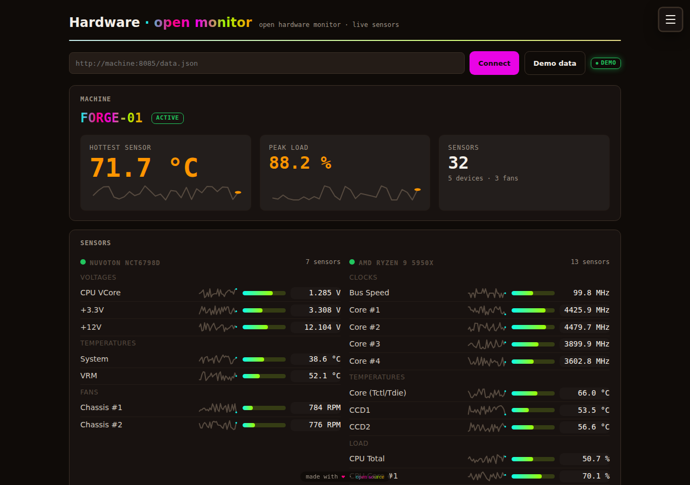
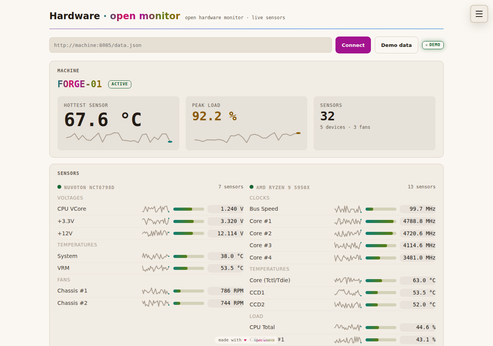
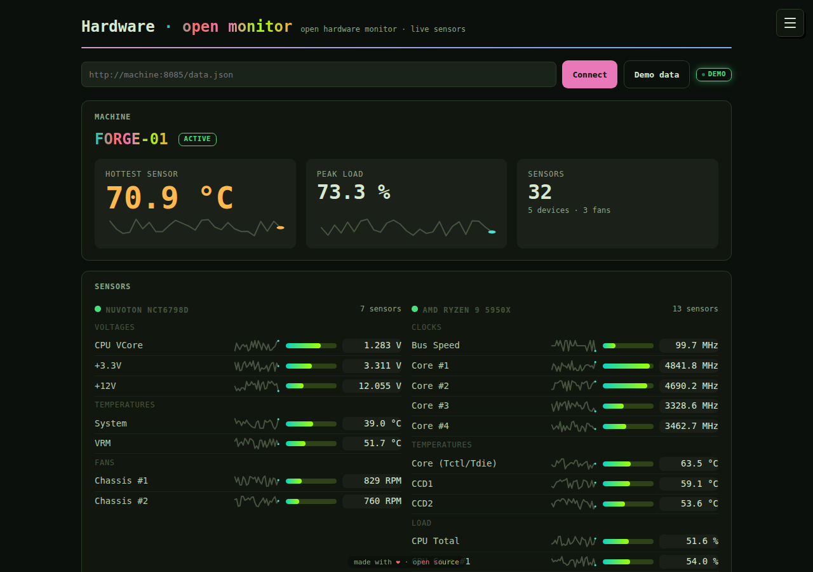
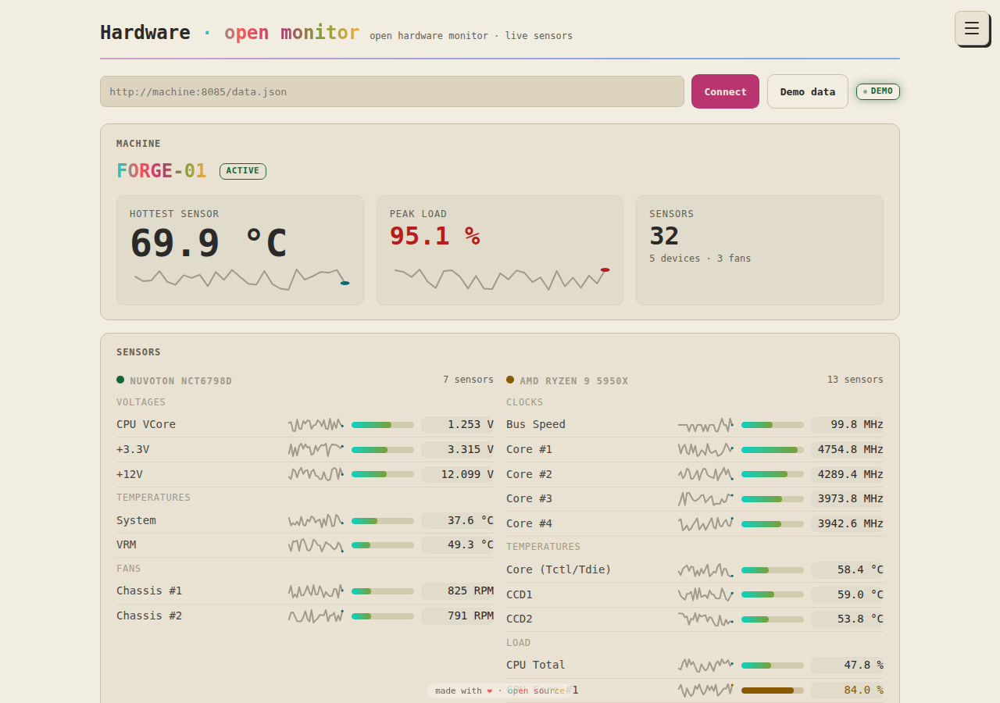
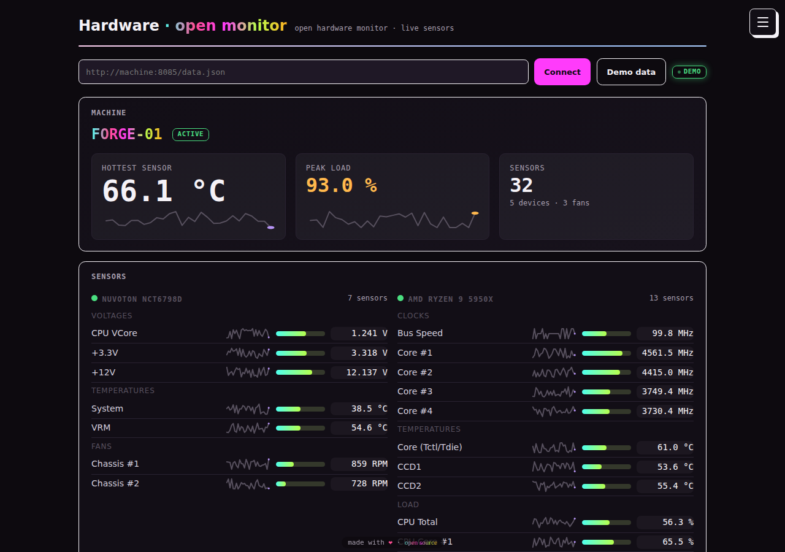
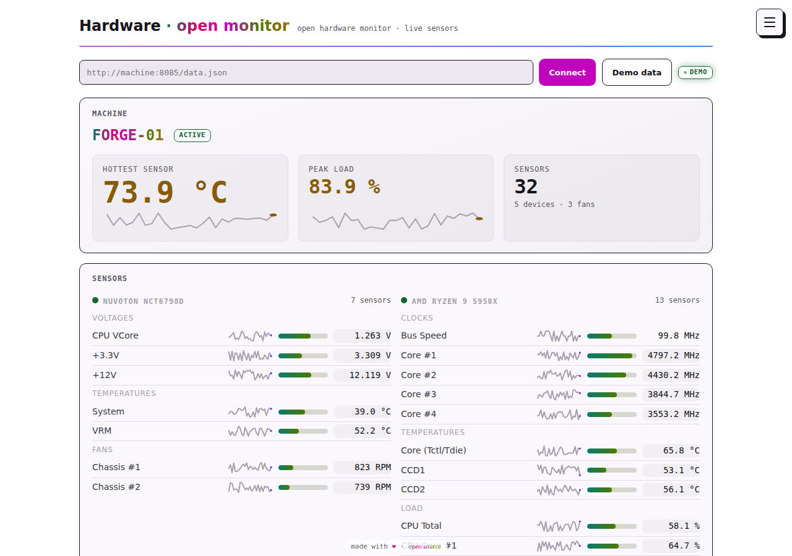

# TTM web dashboard

A static browser dashboard for the machine running Open Hardware Monitor's
embedded web server. No build step, no framework, no tracking.

The desktop application **serves this dashboard itself**: `web/` is
embedded into the executable (OpenHardwareMonitor.csproj → `HttpServer.cs`)
and replaces the legacy jQuery UI, so `http://localhost:<port>/` opens the
TTM app same-origin — live data by default, no CORS or mixed-content walls.
The same files deploy statically to the hosted demo below; `test/` and
`admin/` are site-ops surfaces and are not embedded.

Live demo: **https://ohm.thetechmargin.com** (`?demo=1` for the animated
demo feed, `/components/` for the design-stack gallery, `/test/` for the
self-test bench, `/admin/` for operators). Also served at
https://openhardwaremonitor.vercel.app.

| | Dark mode | Light mode |
|---|---|---|
| **Warm** |  |  |
| **Terminal** |  |  |
| **Zine** |  |  |

Mode follows the OS until you touch the ☀/☾ toggle in the site header;
every combination is WCAG-AA-verified by `/test/` on each run.

## Use cases

- **Workshop presence on the open map** — the machine publishes a SpaceAPI
  signal to Maps of Making: running hardware means the space reads *open*,
  temperatures and fans travel as sensors, Four Corners keeps authorship
  attached, IIIF serves the machine photo zoomable. Bernard, keeper of
  Mother Sands, greets visitors in the menu and points them to the
  workshop.
- **Monitor wall / lab display** — full-screen the dashboard on a spare
  screen beside the machine; the summary strip is readable across the
  room, warn/hot states glow, polling pauses when the tab hides.
- **Kiosk in terminal dress** — the terminal theme (paper, mono,
  WCAG-checked) suits e-ink-ish kiosks and print-adjacent setups; flip
  live with <kbd>t</kbd> or persist it site-wide via `config.js`.
- **Classroom / demo without hardware** — `?demo=1` serves 32 animated
  sensors from a seeded generator; the same seed gives every student the
  same bytes for reproducible exercises.
- **Design-system reference** — `/components/` shows the whole TTM stack
  end to end; `/test/` proves it (120 checks, incl. WCAG contrast across
  all twenty theme variants); the token layer whitelabels from Mission
  Control's editor — live preview, save on device, or publish site-wide
  via `ohm_site_config`.
- **Fork it for your own feed** — `parse.js`/`bridge.js` are pure and
  DOM-free: point them at any display-string sensor tree and the rest of
  the stack comes along.

## Module map

| File | Role |
|---|---|
| `index.html` | the page: source bar, sensor grid, map-bridge receipt |
| `parse.js` | **pure sensor core** (`window.OHMParse`): display-string parsing, tree flattening, thresholds, meter scaling |
| `gui-core.js` | **pure GUI core** (`window.OHMGui`): the desktop application's features — Fahrenheit display, Save Report, hide/rename/plot prefs, column layout |
| `feed.js` | **the app's one feed** (`window.OHMFeed`): resolves the source, reads it, wires the srcbar and tab-visibility. Every page — dashboard included — enters here; demo is a *source*, not a branch |
| `plot/` · `gadget/` · `report/` | the desktop windows as routes: PlotPanel, SensorGadget, ReportForm — same feed, shared preferences |
| `bridge.js` | **map bridge** (`window.OHMBridge`): SpaceAPI v14 fragment for Maps of Making |
| `dashboard.js` | rendering, GUI features, shortcuts — it owns no poll path of its own; data arrives from `feed.js` |
| `demo-data.js` | `window.OHM_DEMO()` — a jittered tree in the server's exact shape, read through the same path a machine is |
| `ttm/` | the TTM stack: tokens, components, site chrome + theme switcher (`theme.js`), whitelabel loader (`brand.js`), toasts, gate/telemetry (see `/THEMING.md`) |
| `admin/` | Mission Control: tiered operator page (visitor/operator) |
| `components/` | end-to-end gallery of the component stack (unlisted) |
| `test/` | the bench: 120 assertions at runtime (81 registered cases; the contrast suite expands across all 20 theme×mode variants), runs from `file://` or `/test/`; `run-headless.js` is the CI entry point |
| `404.html` / `500.html` | error surfaces, same stack and chrome |

## Data contract

The embedded server's `/data.json` (`Utilities/HttpServer.cs`,
`GenerateJSON`) is a pre-order tree of
`{id, Text, Children[], Min, Value, Max, ImageURL}` where **every value is a
preformatted display string** — `"52.0 °C"`, `"1,234 RPM"`. The dashboard
parses numbers back out for meters and thresholds but always shows the
server's own string. Hardware category comes from the node's icon path
(`images_icon/temperature.png` → `temperature`). Sub-hardware (a SuperIO
chip under the mainboard) becomes its own block.

Thresholds (conservative defaults, in `parse.js`): temperature ≥ 70 °C
warn / ≥ 85 °C hot; load ≥ 80 % warn / ≥ 95 % hot.

CORS note: the embedded server sends `Access-Control-Allow-Origin: *` on
`/data.json` and the icon endpoint (the data is read-only, unauthenticated
GET), so the hosted dashboard can poll `http://localhost:<port>` — browsers
exempt loopback from mixed-content blocking. Polling a *different* machine
over plain http from an https page is still blocked by the browser (mixed
content), independent of CORS: for that, open the machine's own served
dashboard, use a local proxy, or use demo data. Served same-origin by the
app, none of this applies — the page connects to `/data.json` automatically.

## GUI parity

The desktop application's GUI runs through this skin (View card on the
dashboard; pure logic in `gui-core.js`, bench-proven). The app's separate
windows are also **served as routes** — `/plot/`, `/gadget/`, `/report/` —
riding the same feed and the same on-device preferences.

Every page shares one source pipeline (`feed.js`): resolve → read → render.
A live machine and the demo feed are both *sources* read through that one
path, so there is a single place data enters the app, a single status path,
and a single failure path. Precedence is explicit demo (`?demo=1`, the Demo
button, or the last mode chosen) → the saved machine → nothing, in which
case the page shows its connect posture rather than substituting mock data.
Connect from any page and every page follows; <kbd>Esc</kbd> pauses, and the
pause outlives a tab switch.

- **Plot** (`PlotPanel.cs`) — plot any sensors from Manage mode; series
  draw in the brand hues from the poll history, normalized to their own
  range, legend carries the live values.
- **Gadget** (`SensorGadget.cs`) — a compact floating readout of the
  plotted sensors (falls back to hottest + peak load).
- **Manage sensors** — the desktop context menu as a mode: hide/unhide
  (with View → *show hidden* rendering them dimmed), rename inline, add
  to plot. All persisted on the device.
- **Columns** (View → Columns) — Value / Min / Max each toggleable; the
  grid re-lays per visible set.
- **Units** (`UnitManager.cs`) — Celsius ↔ Fahrenheit as a display
  transform on the server's own strings (<kbd>u</kbd>).
- **Save Report** (`ReportForm.cs`) — a plain-text report of the whole
  tree, downloaded client-side.
- **Submit Report** (`ReportForm.cs` → `sendButton_Click`, on `/report/`) —
  the application's own submission to the project: the report plus an
  optional comment and email, posted form-urlencoded to
  `openhardwaremonitor.org/report.php` as `type=hardware` with the app's
  version. The payload is byte-for-byte what the desktop app posts
  (bench-pinned). Two honest limits: the endpoint is http-only, so an
  https page says the browser blocks it and offers the submission to copy
  rather than a button that cannot work; and the endpoint sends no CORS
  headers, so a completed request is reported as *sent*, never as
  confirmed-delivered. Reports carry a `Source:` line noting they were
  built from `data.json` by the web dashboard.
- **Reset Min/Max** — clears the local reading history; live min/max
  columns come from the server and reset with it.

## UX

- **Hero band** — the machine leads with stat tiles: hottest sensor (the
  one hero figure of the view), peak load, sensor count — each with a
  40-point trend sparkline built from the poll history the page already
  collects.
- **Sensor rows** carry the app's full data set — Value plus session Min
  and Max (always the server's own strings, min/max muted so the value
  leads; they cede with the sparkline on narrow screens) — and an inline
  sparkline (2px line in de-emphasis ink, no axes; the status color
  appears only on the "now" dot). The meter's unfilled track tints with
  the row's state so warn/hot reads across the whole bar. Fresh readings
  flash once, token-timed. Hardware blocks surface the app's type
  taxonomy (`cpu`, `nvidia`, `mainboard`, …) beside the sensor count, and
  no node the server emits is ever dropped.
- **Signs of life** — the live badge carries a heartbeat dot; device
  cards get a hover wash. All motion wears `--ttm-anim-*` tokens.
- **Frictionless return** — the machine URL persists in localStorage;
  polling pauses when the tab is hidden and resumes on return.

## Keyboard

<kbd>t</kbd>, <kbd>m</kbd>, <kbd>?</kbd> and <kbd>g</kbd>-chords work on every
page; the rest act on the dashboard. Shortcuts never fire while typing
in a field.

| Keys | Action |
|---|---|
| <kbd>d</kbd> | load / restart the demo feed |
| <kbd>/</kbd> | focus the machine-URL field |
| <kbd>u</kbd> | Celsius ↔ Fahrenheit display |
| <kbd>p</kbd> | show / hide the plot |
| <kbd>t</kbd> | cycle the theme world (site-wide, all ten presets) |
| <kbd>m</kbd> | flip light/dark mode (site-wide) |
| <kbd>Esc</kbd> | pause polling |
| <kbd>?</kbd> | open / close the site menu (focus moves in) |
| <kbd>g</kbd> then <kbd>d</kbd>/<kbd>p</kbd>/<kbd>g</kbd>/<kbd>r</kbd> | go to dashboard / plot / gadget / report |
| <kbd>g</kbd> then <kbd>t</kbd>/<kbd>a</kbd>/<kbd>m</kbd> | go to test bench / mission control / Maps of Making |
| <kbd>↑</kbd>/<kbd>↓</kbd> or <kbd>j</kbd>/<kbd>k</kbd> | move between device cards in the sensor tree |
| <kbd>Home</kbd>/<kbd>End</kbd> | first / last device card |
| <kbd>←</kbd>/<kbd>→</kbd> | collapse / expand the focused card |
| <kbd>Enter</kbd>/<kbd>Space</kbd> | toggle the focused card (native) |

The chord handler runs in the capture phase and consumes its keys, so
<kbd>g</kbd>-then-<kbd>t</kbd> navigates without also toggling the theme;
page-level shortcuts skip any key arriving `defaultPrevented`.
`window.TTMNav` exposes the routes and chord state the test bench asserts.

## Accessibility

- **Skip link on every page** — the first tab stop jumps focus to
  `#main` (`tabindex="-1"`), styled above every overlay.
- **Focus is managed, never lost** — the drawer menu moves focus in on
  open, traps <kbd>Tab</kbd>, and returns focus to the burger on close
  (Escape and backdrop both close); keyboard focus in the sensor tree
  survives the 5 s poll re-render; the gate dialog traps focus and
  restores flow on completion.
- **WCAG 2.1 AA, computed not claimed** — the test bench measures
  contrast for every text/status pair and 3:1 for interactive chrome
  (1.4.11), in both themes, from live token values on every run.
- **State is never color-alone** — warn/hot rows carry explanatory
  `title` text and tinted meter tracks alongside the colored value; the
  status badge is a polite live region (`role="status"`,
  `aria-live="polite"`).
- **Light and dark in every preset** — each theme names a *world*
  (warm, terminal, zine) and carries both polarities: warm-light ivory,
  CRT-phosphor terminal-dark, inverted-photocopy zine-dark. The mode follows
  the OS until you touch the ☀/☾ toggle in the page header; all twenty
  combinations (ten worlds × two modes) are WCAG-AA-checked by the
  bench on every run.
- **Reduced motion respected end to end** — `prefers-reduced-motion`
  collapses every transition *and* animation (flash, pulse, shimmer),
  and polling relaxes from 5 s to 20 s so values stop fluttering.
- **44px touch targets**, `aria-expanded`/`aria-controls` on the menu
  disclosure, `aria-current` marks the page you are on, meters and
  sparklines are `aria-hidden` (the value text carries the data).

## Access model (Mission Control)

Tiered, with no dead-ends — nobody who signs in sees a locked door:

- **Visitor (automatic)** — anyone signed in through the gate gets the
  self-service tier: full CRUD on **their own record** (rename, or erase
  it plus all telemetry attributed to it), and a **masked, view-only**
  directory + telemetry of everyone else (emails masked to `f***@d***`,
  no user agents).
- **Operator** — the operator token (sha-256 in `ohm_admin_secrets`,
  held in sessionStorage only) unlocks true CRUD everywhere: unmasked
  reads, rename/delete any visitor, grant/revoke the admin marker,
  purge old telemetry, publish whitelabel config site-wide.

Threat model: gate email claims are unauthenticated — anyone can type
any email — so nothing privileged ever derives from them. A claimed
email can only mutate the row matching that exact email, can never
touch `is_admin` or other rows, and sees only masked PII. Every
privileged mutation requires the token. `supabase/schema.sql` carries
the full RPC surface.

## Publishing to open maps (SpaceAPI · Four Corners · IIIF)

The map-bridge fragment (`bridge.js`) is a SpaceAPI v14 document: register
its URL on Maps of Making and the machine appears as a space signal —
activity as `state.open`, temperatures and fans as `sensors`, refreshed by
the heartbeat. Two open protocols ride along as `ext_*` extensions,
configured per site via `window.OHM_BRIDGE_META` (see the shape documented
at the top of `bridge.js`):

- **Four Corners** (`ext_fourcorners`, fourcornersproject.org) —
  attribution that travels with the signal: authorship/license, backstory
  (defaults to honest provenance of the telemetry), related imagery, links.
- **IIIF Image API 3** (`ext_iiif`, iiif.io) — an `ImageService3` block so
  any IIIF viewer can deep-zoom the machine photo; `logo` carries the
  static fallback image.
- **Manufacturing capabilities** (`ext_tags` + `ext_okw`) — Wikidata QIDs
  and OKW equipment records per the OHM×Maps-of-Making integration plan:
  QIDs are the shared vocabulary hub between MoM's activity ontology
  (`owl:sameAs`) and Open Hardware Manager's OKW records, so the machine's
  live signal is discoverable by capability queries ("find spaces that can
  laser-cut") the moment those systems ingest it. Set `meta.capabilities`
  (QIDs) and `meta.equipment` (OKW field names).

## Tests

Open `test/index.html` (append `?nogate=1` to skip the visitor gate). 120
assertions at runtime (81 registered cases; the contrast suite expands per
theme×mode): the TTM stack (tokens incl. the full theme-able vocabulary,
the whitelabel loader and runtime, legacy theme selectors, toasts, gate,
telemetry), WCAG 2.1 contrast computed from live tokens across all
twenty theme×mode combinations, the chrome contract (pure-chrome
sitebar, consolidated menu, keyboard/nav), the standardization sweep
(zero inline styles, zero page-local CSS on any route), the sensor core
(incl. app fidelity: min/max carried, no node dropped), seeded
demo/fixture data, and the map bridge with its Four Corners and IIIF
extensions. Results land in `window.__TTM_TEST_RESULTS`.

**CI runs the same bench** — `.github/workflows/web-tests.yml` executes
`web/test/run-headless.js` (Playwright Chromium against a throwaway
static server) on every push and pull request touching `web/`, and fails
the build on any failed assertion or page error. Run it locally:

```bash
npm install playwright && npx playwright install --with-deps chromium
node web/test/run-headless.js
```

## Deploy

`build-web.sh` stages `web/` into `public/`; `vercel.json` carries the
build command. Optional Supabase (visitor gate + telemetry + whitelabel,
`ohm_` tables): run `supabase/schema.sql`, set `SUPABASE_URL` /
`SUPABASE_ANON_KEY` in the deployment env, redeploy. Without them
everything runs local-only.

Security model (hardened for a shared database): the anon key can only
call whitelisted RPCs — validated, size-capped writes for the gate and
telemetry, a boolean admin probe, and public reads of the whitelabel
config. Visitor PII is never readable with the anon key. Mission
Control's reads and publishes require the **operator token** (set once in
`ohm_admin_secrets` per the instructions in `schema.sql`; the UI asks for
it and keeps it in sessionStorage only), and `is_admin` can only be
granted from the SQL editor.
